# Database Schema Diagram

The platform uses **PostgreSQL** with **TypeORM** (`synchronize: true` in development — tables are created/updated automatically from the entity definitions in `server/src/entities/`).

## Entity-Relationship Diagram

```mermaid
erDiagram
    ROLES ||--o{ USERS : "has"
    DISTRICTS ||--o{ USERS : "assigned to"
    DISTRICTS ||--o{ MANDALS : "contains"
    MANDALS ||--o{ VILLAGES : "contains"

    DISTRICTS ||--o{ COMPLAINTS : "located in"
    MANDALS ||--o{ COMPLAINTS : "located in"
    VILLAGES ||--o{ COMPLAINTS : "located in"
    CATEGORIES ||--o{ COMPLAINTS : "categorized as"
    USERS ||--o{ COMPLAINTS : "created_by"
    USERS ||--o{ COMPLAINTS : "assigned_to"

    COMPLAINTS ||--o{ COMPLAINT_UPDATES : "has timeline"
    USERS ||--o{ COMPLAINT_UPDATES : "posted by"

    COMPLAINTS ||--o{ ATTACHMENTS : "has files"
    USERS ||--o{ ATTACHMENTS : "uploaded by"

    COMPLAINTS ||--o{ ASSIGNMENTS : "assignment history"
    USERS ||--o{ ASSIGNMENTS : "assigned_by"
    USERS ||--o{ ASSIGNMENTS : "assigned_to"

    USERS ||--o{ NOTIFICATIONS : "receives"
    USERS ||--o{ REFRESH_TOKENS : "owns"
    USERS ||--o{ AUDIT_LOGS : "performed by"

    ROLES {
        uuid id PK
        varchar name "super_admin | state_admin | district_admin | volunteer"
        jsonb permissions
        timestamp created_at
    }

    PERMISSIONS {
        uuid id PK
        varchar name UK
        varchar description
    }

    USERS {
        uuid id PK
        varchar name
        varchar email UK
        varchar password "bcrypt hash"
        varchar phone
        uuid role_id FK
        uuid district_id FK "nullable"
        boolean is_active
        timestamp created_at
        timestamp updated_at
    }

    DISTRICTS {
        uuid id PK
        varchar name UK
        varchar state
    }

    MANDALS {
        uuid id PK
        varchar name
        uuid district_id FK
    }

    VILLAGES {
        uuid id PK
        varchar name
        uuid mandal_id FK
    }

    CATEGORIES {
        uuid id PK
        varchar name UK
        text description
        varchar icon "lucide-react icon name"
        boolean is_active
    }

    COMPLAINTS {
        uuid id PK
        varchar ticket_number UK "GRV-YYYY-XXXXX"
        varchar title
        text description
        varchar status "pending|assigned|in_progress|resolved|closed|rejected"
        varchar priority "low|medium|high|critical"
        uuid category_id FK
        varchar citizen_name
        varchar citizen_phone
        varchar citizen_email "nullable"
        uuid district_id FK
        uuid mandal_id FK
        uuid village_id FK "nullable"
        uuid assigned_to FK "nullable, -> users.id"
        uuid created_by FK "nullable, -> users.id"
        timestamp resolved_at "nullable"
        timestamp created_at
        timestamp updated_at
    }

    COMPLAINT_UPDATES {
        uuid id PK
        uuid complaint_id FK
        uuid updated_by FK "-> users.id"
        varchar status
        text comment
        timestamp created_at
    }

    ATTACHMENTS {
        uuid id PK
        uuid complaint_id FK
        varchar file_url
        varchar file_name
        varchar file_type "image|pdf|video"
        integer file_size
        uuid uploaded_by FK "nullable, -> users.id"
        timestamp created_at
    }

    ASSIGNMENTS {
        uuid id PK
        uuid complaint_id FK
        uuid assigned_by FK "-> users.id"
        uuid assigned_to FK "-> users.id"
        text notes
        timestamp assigned_at
    }

    NOTIFICATIONS {
        uuid id PK
        uuid user_id FK
        varchar title
        text message
        varchar type
        boolean is_read
        uuid reference_id "nullable"
        timestamp created_at
    }

    REFRESH_TOKENS {
        uuid id PK
        uuid user_id FK
        varchar token UK
        timestamp expires_at
        boolean is_revoked
        timestamp created_at
    }

    AUDIT_LOGS {
        uuid id PK
        uuid user_id FK "nullable"
        varchar action
        varchar entity
        uuid entity_id "nullable"
        jsonb meta "nullable"
        varchar ip_address "nullable"
        timestamp created_at
    }
```

## Table Notes

| Table | Purpose |
|---|---|
| `roles` | Defines the 4 platform roles and their permission lists (`permissions` jsonb array). |
| `permissions` | Master catalog of permission names referenced by roles (descriptive only — enforcement reads from `roles.permissions`). |
| `users` | All platform staff accounts (admins/volunteers). `district_id` is `null` for state-level roles (`super_admin`, `state_admin`). |
| `districts` / `mandals` / `villages` | Geographic hierarchy used for location-scoping complaints and users. Cascade delete downward (district → mandals → villages). |
| `categories` | Complaint categories (Infrastructure, Healthcare, etc.) shown in dropdowns. |
| `complaints` | Core grievance ticket. `assigned_to`/`created_by` reference `users` and are `eager: true` loaded (sanitized before being sent to the client — see `server/src/utils/sanitize.ts`). |
| `complaint_updates` | Append-only timeline/audit trail of status changes and comments on a complaint. |
| `attachments` | Uploaded files (image/pdf/video) linked to a complaint; physical files live under `UPLOAD_DIR`. |
| `assignments` | History log of every assignment action (who assigned what to whom, with notes). |
| `notifications` | Per-user in-app notification feed (polled by the client; real-time socket push is optional). |
| `refresh_tokens` | Long-lived (7 day) tokens stored server-side to support `/api/auth/refresh` and logout/revocation. |
| `audit_logs` | System-wide audit trail of sensitive actions (login, create/update/delete user, complaint changes, etc.). |

## Role → Visibility Matrix

| Role | `district_id` | Complaint visibility (`GET /api/complaints`) | User management visibility |
|---|---|---|---|
| `super_admin` | `null` | All complaints | All users |
| `state_admin` | `null` | All complaints | All users |
| `district_admin` | set | Only `complaint.district_id = own district` | Only users in own district |
| `volunteer` | set | Only `complaint.assigned_to = own user id` | N/A |
